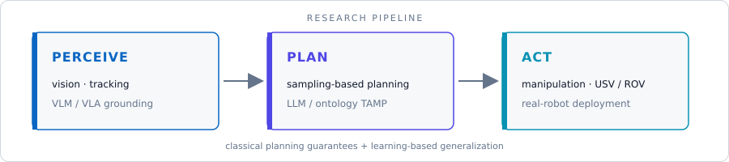

 

&nbsp;
&nbsp;
&nbsp;

---

## About

Postdoctoral Research Fellow at the **Khalifa University Center for Autonomous Robotic Systems (KUCARS)** in Abu Dhabi, and part of the team setting up a new robotics research lab at **Higher Colleges of Technology (HCT)**.

My goal is to take robots out of the lab and make them **robust, intelligent, and unafraid of the real world**. My work connects **classical motion planning and control** with **modern learning-based methods**: foundation models that reason and act, planners that come with guarantees, and systems that run on real hardware, from tabletop arms to autonomous surface vessels.

<table>
<tr>
<td width="50%" valign="top">

### Research Areas

- **Sampling-based motion planning**: informed and asymptotically optimal planners
- **Task and motion planning (TAMP)**: LLM- and ontology-driven symbolic reasoning
- **Vision-language-action models**: generalist policies for manipulation
- **World models and embodied AI**: predictive models for planning
- **Marine robotics**: USV/ROV autonomy, inspection, and maritime security
- **Robotic perception**: visual servoing, tracking, and underwater vision

</td>
<td width="50%" valign="top">

### Background

- **Ph.D.**, Automatic Control, Robotics and Computer Vision, UPC Barcelona *Thesis: Physics-based Motion Planning for Grasping and Manipulation*
- **Project Manager**, MBZIRC Maritime Grand Challenge (USV + UAV + manipulator in GNSS-denied conditions)
- **R&D Engineer**, ITK Engineering (Bosch Group): medical robotics, AR
- **Visiting researcher**, Kavraki Lab (Rice University) and DLR Institute of Robotics and Mechatronics

</td>
</tr>
</table>

---

## Featured Projects

<table>
<tr>
<td width="33%" valign="top">

**[VLAs](https://github.com/Muhayyuddin/VLAs)**
 Vision-language-action models for robot learning and manipulation.

</td>
<td width="33%" valign="top">

**[llm-tamp](https://github.com/Muhayyuddin/llm-tamp)**
 LLM-driven task and motion planning with knowledge-based reasoning.

</td>
<td width="33%" valign="top">

**[llm-vlm-fusion-port-inspection](https://github.com/Muhayyuddin/llm-vlm-fusion-port-inspection)**
 LLM + VLM fusion for autonomous port inspection.

</td>
</tr>
<tr>
<td width="33%" valign="top">

**[vision-tracking](https://github.com/Muhayyuddin/vision-tracking)**
 Vision-based object tracking for robotic systems.

</td>
<td width="33%" valign="top">

**[visual-servoing](https://github.com/Muhayyuddin/visual-servoing)**
 Visual servoing for manipulation and control.

</td>
<td width="33%" valign="top">

**[ros-docker](https://github.com/Muhayyuddin/ros-docker)**
 Containerized ROS development environments.

</td>
</tr>
</table>

---

## Tech Stack

**Hardware experience:** ABB YuMi · KUKA LWR · PAL TIAGo · UR5 / UR10 · Franka FR3 · Bravo5 underwater manipulator

---

*"I don't have any comfort zone. I can quickly adapt to new tools for tackling challenging problems."*

